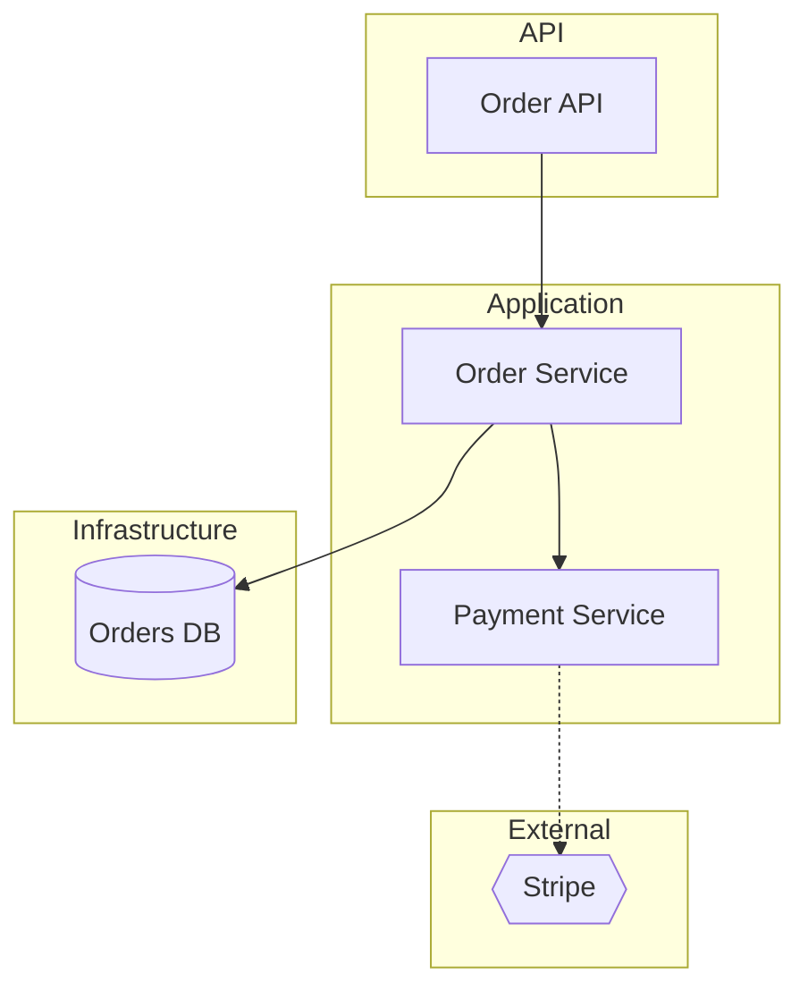

Act as the codebase-sme agent acting as a software architect. Produce an architecture view. Focus: **$ARGUMENTS** (default: the whole system).

## Steps
1. Read `.sme/codebase-knowledge.json` (if missing, tell the user to run `/sme-scan`). The `modules`, `module_interactions`, `data_model`, and `cross_cutting` sections are your primary source here.
2. Only open source files if you need to confirm a specific relationship the knowledge file marks as `inferred`.

## Output contract

**Architecture at a glance** — a short paragraph: architectural style (layered, modular monolith, microservices, etc.), the main building blocks, and how a request generally flows.

**Diagram (Mermaid `flowchart`):**
- Group nodes by layer using subgraphs (e.g. API / Application / Domain / Infrastructure / External).
- Nodes = modules and significant external systems and datastores.
- Edges = real dependencies from `module_interactions`.
- Use a distinct edge style (dashed) for any edge whose confidence is `inferred`, and add a legend line explaining that dashed = inferred/unverified.
- Keep it readable: if there are many modules, show the primary ones and note that minor/shared modules are omitted for clarity.

Example skeleton (adapt to the real system — do not emit this literally):

**Layer responsibilities** — a short list: what each layer/tier is responsible for.

**Key cross-cutting concerns** — auth, logging, error handling, configuration, from the knowledge file.

**Architectural observations** — senior-level commentary: strengths, smells (e.g. a UI layer reaching straight into the DB, a god-module, circular dependencies), and what a newcomer should understand about *why* it's shaped this way.

**Confidence & gaps** — state which relationships are confirmed vs inferred, and list any `open_questions` from the knowledge file relevant to the architecture.
