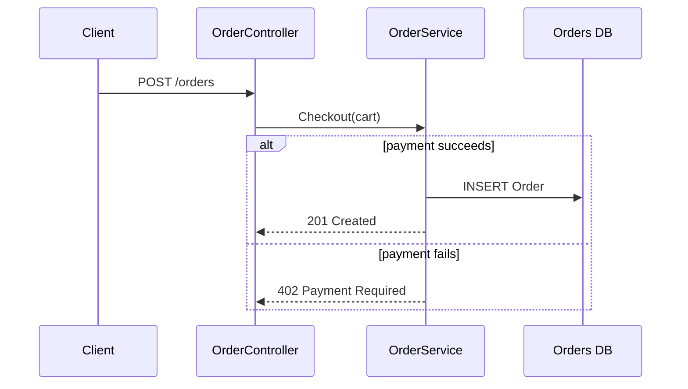

Act as the codebase-sme agent. Map the end-to-end runtime workflow for: **$ARGUMENTS**

## Steps
1. Read `.sme/codebase-knowledge.json` (if missing, tell the user to run `/sme-scan`).
2. Identify the entry point for this operation, then open the specific files along the path to trace the real sequence — this command needs code-level truth, not just the map.
3. Follow the actual control flow, including significant branches (success/failure, conditional paths) and side effects.

## Output contract

**Workflow summary** — 2–3 sentences: what triggers this, and what state has changed once it completes.

**Trigger** — how it starts (user action, endpoint, schedule, event), with the real handler name/file.

**Sequence diagram (Mermaid `sequenceDiagram`):**
- Participants = the real actors/components (e.g. Client, Controller, Service, Repository, DB, external API).
- Show messages in execution order with real method names.
- Show important branches with `alt`/`opt` blocks (e.g. payment success vs failure).
- Mark any step you inferred rather than confirmed with a `Note` in the diagram.

Example skeleton (adapt — do not emit literally):

**Step detail** — a numbered list matching the diagram, each step naming the file/method and describing what happens, what data is read/written, and what can go wrong at that step.

**Failure & edge behavior** — what happens on the unhappy paths (validation failure, external timeout, partial failure). If the code does not handle a case, say so — that's valuable.

**Verification note** — which steps you confirmed by reading code vs. inferred.
